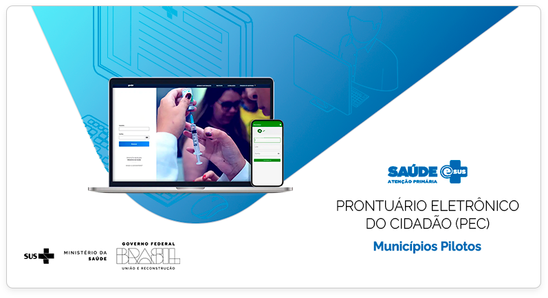

 
 
 
 
 
 
*Elaboração, distribuição e informações* 

**MINISTÉRIO DA SAÚDE** 
Secretaria de Atenção Primária à Saúde 
Departamento de Saúde da Família 
Esplanada dos Ministérios - Bloco G - 7º andar 
CEP: 70.058-900 – Brasília/DF 
Tels.: (61) 3315-8090 / 3315-8044 
Site: <http://sisaps.saude.gov.br/esus/> 
Suporte: <http://esusaps.bridge.ufsc.br/support/login>

**Supervisor Geral** 
Nésio Fernandes de Medeiros Junior

**Coordenação Técnica Geral** 
Rodrigo André Cuevas Gaete

**Organização** 
Igor de Carvalho Gomes

**Revisão Técnica** 
Igor de Carvalho Gomes, Willian Soares Lima, Elaine Almeida.

**Elaboração de texto** 
Rodrigo André Cuevas Gaete, Igor de Carvalho Gomes, Willian Soares Lima, Elaine Almeida, Janaína Nogueira Guimarães, Vania Priamo.

**Projeto Gráfico** 
Alexandre Soares de Brito e Diogo Ferreira Gonçalves
 
 
 

**Ficha Catalográfica**
{: .text-center }

Brasil. Ministério da Saúde. Secretaria de Atenção Primária à Saúde. 
e-SUS Atenção Primária à Saúde: Manual do Sistema com Prontuário Eletrônico do Cidadão PEC – Versão 4.3 [recurso eletrônico] / Ministério da Saúde, Secretaria de Atenção Primária à Saúde, Secretaria Executiva. – Brasília: Ministério da Saúde, 2021. 
 
ISBN **Versão Preliminar** 
Modo de acesso: <https://aps.saude.gov.br/ape/esus> 
CDU 614 

Catalogação na fonte – Coordenação-Geral de Documentação e Informação – Editora MS – OS 2021.
